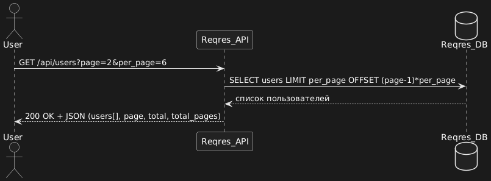

# API Sequence Diagrams

Ниже представлены последовательные диаграммы взаимодействия для каждого эндпоинта.

## 1. Получение списка пользователей

**Эндпоинт:** `GET /api/users?page=2`

## 2. Получение пользователя по ID
[Посмотреть диаграмму](./diagrams/get-user-by-id.png)

## 3. Создание пользователя (POST)
[Посмотреть диаграмму](./diagrams/create-user.png)

## 4. Обновление пользователя (PUT)
[Посмотреть диаграмму](./diagrams/put-user.png)

## 5. Частичное обновление пользователя (PATCH)
[Посмотреть диаграмму](./diagrams/patch-user.png)

## 6. Удаление пользователя (DELETE)
[Посмотреть диаграмму](./diagrams/delete-user.png)
