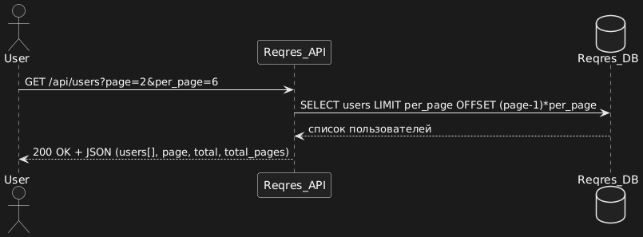
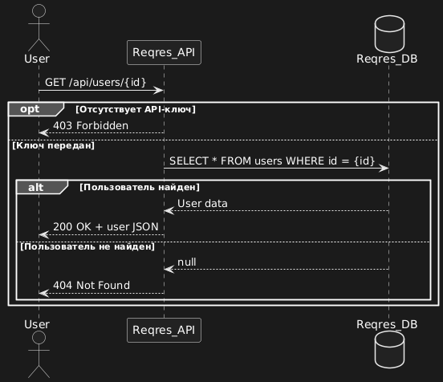
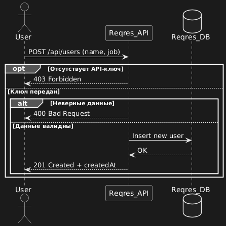
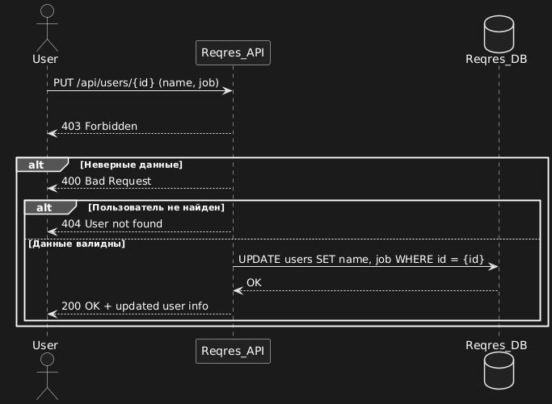
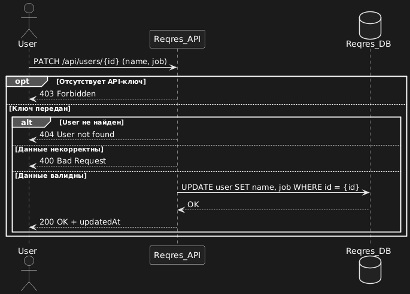
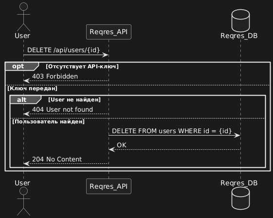

# API Activity Diagrams

# API Usecase Diagrams

# API Sequence Diagrams

## 1. Получение списка пользователей

**Эндпоинт:** `GET /api/users?page=2`

## 2. Получение пользователя по ID

**Эндпоинт:** `GET /api/users/{id}`

## 3. Создание пользователя (POST)

**Эндпоинт:** `POST /api/users`

## 4. Обновление пользователя (PUT)

**Эндпоинт:** `PUT /api/users/{id}`

## 5. Частичное обновление пользователя (PATCH)

**Эндпоинт:** `PATCH /api/users/{id}`

## 6. Удаление пользователя (DELETE)

**Эндпоинт:** `DELETE /api/users/{id}`

